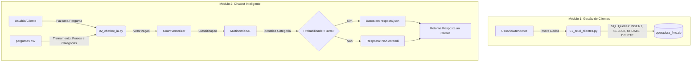

# Projeto RITA - Chatbot e CRUD para Operadora de Crédito

Este projeto é uma simulação de um sistema para um correspondente bancário/operadora de crédito. Ele é dividido em dois componentes principais: um sistema de gestão de clientes (CRUD) utilizando SQLite e um Chatbot com Inteligência Artificial para classificação de intenções usando Machine Learning.

## 🚀 Como Executar o Projeto

### Pré-requisitos
Certifique-se de ter o **Python 3.x** instalado em sua máquina.
Você também precisará instalar as seguintes bibliotecas de terceiros:
- `pandas`
- `scikit-learn`

Você pode instalá-las utilizando o gerenciador de pacotes `pip` no terminal:

```bash
pip install pandas scikit-learn
```

### Passo a Passo

1. **Clone este repositório** (se ainda não o fez):
   ```bash
   git clone https://github.com/wellalvesb/Chatbot-ritafmu-weltonalves.git
   cd Chatbot-ritafmu-weltonalves
   ```

2. **Para executar o Sistema de Gestão de Clientes (CRUD):**
   Abra seu terminal na pasta do projeto e digite:
   ```bash
   python 01_crud_clientes.py
   ```
   *Siga as instruções na tela para cadastrar novos clientes. O banco de dados `operadora_fmu.db` será criado/atualizado automaticamente.*

3. **Para executar o Chatbot IA:**
   No terminal, digite:
   ```bash
   python 02_chatbot_ia.py
   ```
   *Você poderá interagir com o chatbot digitando suas dúvidas sobre cartão de crédito. Digite `sair` para finalizar.*

---

## 🧠 Explicação do Código

O projeto está dividido em dois arquivos principais de script:

- **`01_crud_clientes.py`**: Um script simples para gerenciar clientes. Ele usa a biblioteca nativa `sqlite3` para conectar a um banco de dados local. Ele cria a tabela de clientes (caso não exista), permite a inserção de dados via terminal e demonstrações de leitura, atualização (UPDATE) e exclusão (DELETE).
- **`02_chatbot_ia.py`**: É o núcleo da IA. Ele carrega uma base de treinamento (`perguntas.csv`) usando o `pandas`. As frases são vetorizadas (transformadas em números) usando o `CountVectorizer` e treinadas em um modelo probabilístico Naive Bayes (`MultinomialNB`) através da biblioteca `scikit-learn`. Quando o usuário faz uma pergunta, o modelo prevê a categoria da intenção e busca a resposta ideal no arquivo `resposta.json`.

---

## 🏗️ Arquitetura do Sistema

A arquitetura foi projetada para ser modular e de fácil execução.

### Fluxograma



### Componentes de Dados
- **`operadora_fmu.db`**: Banco de dados relacional (SQLite) onde as informações de clientes e cartões ficam armazenadas.
- **`perguntas.csv`**: Dataset contendo exemplos de perguntas reais que os usuários fazem, mapeadas para categorias específicas.
- **`resposta.json`**: Dicionário chave-valor que atrela a categoria identificada pela IA a uma resposta amigável e pronta para o cliente.
